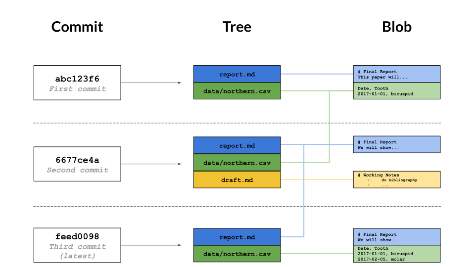

# [Introduction to Git](https://www.datacamp.com/courses/introduction-to-git)

# CH1 - Basic Workflow

## What is version control?

A **version control system** is a tool that manages changes made to the files and directories in a project. Many version control systems exist; this lesson focuses on one called Git, which is used by many of the data science tools covered in our other lessons. Its strengths are:

- Nothing that is saved to Git is ever lost, so you can always go back to see which results were generated by which versions of your programs.
    
- Git automatically notifies you when your work conflicts with someone else's, so it's harder (but not impossible) to accidentally overwrite work.
    
- Git can synchronize work done by different people on different machines, so it scales as your team does.
    

Version control isn't just for software: books, papers, parameter sets, and anything that changes over time or needs to be shared can and should be stored and shared using something like Git.

## Where does Git store information?

Each of your Git projects has two parts: the files and directories that you create and edit directly, and the extra information that Git records about the project's history. The combination of these two things is called a **repository**.

Git stores all of its extra information in a directory called `.git` located in the root directory of the repository. Git expects this information to be laid out in a very precise way, so you should never edit or delete anything in `.git`.

## How can I check the state of a repository?

When you are using Git, you will frequently want to check the **status** of your repository. To do this, run the command `git status`, which displays a list of the files that have been modified since the last time changes were saved.

## How can I tell what I have changed?

Git has a **staging area** in which it stores files with changes you want to save that haven't been saved yet. Putting files in the staging area is like putting things in a box, while **committing** those changes is like putting that box in the mail: you can add more things to the box or take things out as often as you want, but once you put it in the mail, you can't make further changes.


`git status` shows you which files are in this staging area, and which files have changes that haven't yet been put there.

## What is in a diff?

A **diff** is a formatted display of the differences between two sets of files.In order to compare the file as it currently is to what you last saved, you can use `git diff filename`. `git diff` without any filenames will show you all the changes in your repository, while `git diff directory` will show you the changes to the files in some directory. Git displays diffs like this:

```bash
diff --git a/report.txt b/report.txt
index e713b17..4c0742a 100644
--- a/report.txt
+++ b/report.txt
@@ -1,4 +1,5 @@
-# Seasonal Dental Surgeries 2017-18
+# Seasonal Dental Surgeries (2017) 2017-18
+# TODO: write new summary 
```

This shows:

- The command used to produce the output (in this case, `diff --git`). In it, `a` and `b` are placeholders meaning "the first version" and "the second version".
- An index line showing keys into Git's internal database of changes.
- `--- a/report.txt` and `+++ b/report.txt`, wherein lines being *removed* are prefixed with `-` and lines being added are prefixed with `+`.
- A line starting with `@@` that tells *where* the changes are being made. The pairs of numbers are `start line` and `number of lines` (in that section of the file where changes occurred). This diff output indicates changes starting at line 1, with 5 lines where there were once 4.
- A line-by-line listing of the changes with `-` showing deletions and `+` showing additions (we have also configured Git to show deletions in red and additions in green). Lines that *haven't* changed are sometimes shown before and after the ones that have in order to give context; when they appear, they *don't* have either `+` or `-` in front of them.

## What's the first step in saving changes?

You commit changes to a Git repository in two steps:

1.  Add one or more files to the staging area.
2.  Commit everything in the staging area.

To add a file to the staging area, use `git add filename`.

## How can I tell what's going to be committed?

To compare the state of your files with those in the staging area, you can use `git diff -r HEAD`. The `-r` flag means "compare to a particular revision", and `HEAD` is a shortcut meaning "the most recent commit".

You can restrict the results to a single file or directory using `git diff -r HEAD path/to/file`, where the path to the file is relative to where you are (for example, the path from the root directory of the repository).

## How do I commit changes?

To save the changes in the staging area, you use the command `git commit`. It always saves everything that is in the staging area as one unit: as you will see later, when you want to undo changes to a project, you undo all of a commit or none of it.

When you commit changes, Git requires you to enter a **log message**. This serves the same purpose as a comment in a program: it tells the next person to examine the repository why you made a change.

By default, Git launches a text editor to let you write this message. To keep things simple, you can use `-m "some message in quotes"` on the command line to enter a single-line message like this:

```bash
git commit -m "Program appears to have become self-aware." 
```

If you accidentally mistype a commit message, you can change it using the `--amend` flag.

```bash
git commit --amend - m "new message" 
```

Writing a one-line log message with `git commit -m "message"`is good enough for very small changes, but your collaborators (including your future self) will appreciate more information. If you run `git commit` *without* `-m "message"`, Git launches a text editor with a template like this:

```bash
# Please enter the commit message for your changes. Lines starting
# with '#' will be ignored, and an empty message aborts the commit.
# On branch master
# Your branch is up-to-date with 'origin/master'.
#
# Changes to be committed:
#       modified:   skynet.R
# 
```

The lines starting with `#` are comments, and won't be saved. (They are there to remind you what you are supposed to do and what files you have changed.) Your message should go at the top, and may be as long and as detailed as you want.

## How can I view a repository's history?

The command `git log` is used to view the **log** of the project's history. Log entries are shown most recent first, and look like this:

```bash
commit 0430705487381195993bac9c21512ccfb511056d
Author: Rep Loop <repl@datacamp.com>
Date:   Wed Sep 20 13:42:26 2017 +0000

    Added year to report title. 
```

The `commit` line displays a unique ID for the commit called a **hash**; we will explore these further in the next chapter. The other lines tell you who made the change, when, and what log message they wrote for the change.

When you run `git log`, Git automatically uses a pager to show one screen of output at a time. Press the space bar to go down a page or the 'q' key to quit.

A project's entire log can be overwhelming, so it's often useful to inspect only the changes to particular files or directories. You can do this using `git log path`, where `path` is the path to a specific file or directory. The log for a file shows changes made to that file; the log for a directory shows when files were added or deleted in that directory, rather than when the contents of the directory's files were changed.

Passing `-` followed by a number to `git log`  restricts the output to that many commits. For example, `git log -3 report.txt` shows you the last three commits involving `report.txt`.

* * *

# CH2 - Repositories

# How does Git store information?

You may wonder what information is stored by each commit that you make. Git uses a three-level structure for this.

1.  A **commit** contains metadata such as the author, the commit message, and the time the commit happened. In the diagram below, the most recent commit is at the bottom (`feed0098`), underneath its parent commits.
2.  Each commit also has a **tree**, which tracks the names and locations in the repository when that commit happened. In the oldest (top) commit, there were two files tracked by the repository.
3.  For each of the files listed in the tree, there is a **blob**. This contains a compressed snapshot of the contents of the file when the commit happened (blob is short for *binary large object*, which is a SQL database term for "may contain data of any kind"). In the middle commit, `report.md` and `draft.md` were changed, so the blobs are shown next to that commit. `data/northern.csv` didn't change in that commit, so the tree links to the blob from the previous commit. Reusing blobs between commits help make common operations fast and minimizes storage space.



## What is a hash?

Every commit to a repository has a unique identifier called a **hash** (since it is generated by running the changes through a pseudo-random number generator called a **hash function**). This hash is normally written as a 40-character hexadecimal string like `7c35a3ce607a14953f070f0f83b5d74c2296ef93`, but most of the time, you only have to give Git the first 6 or 8 characters in order to identify the commit you mean.

Hashes are what enable Git to share data efficiently between repositories. If two files are the same, their hashes are guaranteed to be the same. Similarly, if two commits contain the same files and have the same ancestors, their hashes will be the same as well. Git can therefore tell what information needs to be saved where by comparing hashes rather than comparing entire files.

## How can I view a specific commit?

To view the details of a specific commit, you use the command `git show` with the first few characters of the commit's hash. For example, the command `git show 0da2f7` produces this:

```bash
commit 0da2f7ad11664ca9ed933c1ccd1f3cd24d481e42
Author: Rep Loop <repl@datacamp.com>
Date:   Wed Sep 5 15:39:18 2018 +0000

    Added year to report title.

diff --git a/report.txt b/report.txt
index e713b17..4c0742a 100644
--- a/report.txt
+++ b/report.txt
@@ -1,4 +1,4 @@
-# Seasonal Dental Surgeries 2017-18
+# Seasonal Dental Surgeries (2017) 2017-18

 TODO: write executive summary. 
```

The first part is the same as the log entry shown by `git log`. The second part shows the changes; as with `git diff`, lines that the change removed are prefixed with `-`, while lines that it added are prefixed with `+`.

## What is Git's equivalent of a relative path?

A hash is like an absolute path: it identifies a specific commit. Another way to identify a commit is to use the equivalent of a relative path. The special label `HEAD`, which we saw in the previous chapter, always refers to the most recent commit. The label `HEAD~1` then refers to the commit before it, while `HEAD~2` refers to the commit before that, and so on.

Note that the symbol between `HEAD` and the number is a tilde `~`, *not* a minus sign `-`, and that there cannot be spaces before or after the tilde.

## How can I see who changed what in a file?

`git log` displays the overall history of a project or file, but Git can give even more information. The command `git annotate file` shows who made the last change to each line of a file and when. For example, the first three lines of output from `git annotate report.txt` look something like this:

```bash
04307054        (  Rep Loop     2017-09-20 13:42:26 +0000       1)# Seasonal Dental Surgeries (2017) 2017-18
5e6f92b6        (  Rep Loop     2017-09-20 13:42:26 +0000       2)
5e6f92b6        (  Rep Loop     2017-09-20 13:42:26 +0000       3)TODO: write executive summary. 
```

Each line contains five elements, with elements two to four enclosed in parentheses. When inspecting the first line, we see:

1.  The first eight digits of the hash, `04307054`.
2.  The author, `Rep Loop`.
3.  The time of the commit, `2017-09-20 13:42:26 +0000`.
4.  The line number, `1`.
5.  The contents of the line, `# Seasonal Dental Surgeries (2017) 2017-18`.

## How can I see what changed between two commits?

`git show` with a commit ID shows the changes made *in* a particular commit. To see the changes *between* two commits, you can use `git diff ID1..ID2`, where `ID1` and `ID2` identify the two commits you're interested in, and the connector `..` is a pair of dots. For example, `git diff abc123..def456` shows the differences between the commits `abc123` and `def456`, while `git diff HEAD~1..HEAD~3` shows the differences between the state of the repository one commit in the past and its state three commits in the past.

## How do I add new files?

Git does not track files by default. Instead, it waits until you have used `git add` at least once before it starts paying attention to a file.

In the diagram you saw at the start of the chapter, the untracked files won't have a blob, and won't be listed in a tree.

The untracked files won't benefit from version control, so to make sure you don't miss anything, `git status` will always tell you about files that are in your repository but aren't (yet) being tracked.

## How do I tell Git to ignore certain files?

Data analysis often produces temporary or intermediate files that you don't want to save. You can tell it to stop paying attention to files you don't care about by creating a file in the root directory of your repository called `.gitignore` and storing a list of **wildcard** patterns that specify the files you don't want Git to pay attention to. For example, if `.gitignore` contains:

```bash
build
*.mpl 
```

then Git will ignore any file or directory called `build` (and, if it's a directory, anything in it), as well as any file whose name ends in `.mpl`.

## How can I remove unwanted files?

Git can help you clean up files that you have told it you don't want. The command `git clean -n` will show you a list of files that are in the repository, but whose history Git is not currently tracking. A similar command `git clean -f` will then delete those files.

*Use this command carefully:* `git clean` only works on untracked files, so by definition, their history has not been saved. If you delete them with `git clean -f`, they're gone for good.

## How can I see how Git is configured?

Like most complex pieces of software, Git allows you to change its default settings. To see what the settings are, you can use the command `git config --list` with one of three additional options:

- `--system`: settings for every user on this computer.
- `--global`: settings for every one of your projects.
- `--local`: settings for one specific project.

Each level overrides the one above it, so **local settings** (per-project) take precedence over **global settings** (per-user), which in turn take precedence over **system settings** (for all users on the computer).

## How can I change my Git configuration?

Most of Git's settings should be left as they are. However, there are two you should set on every computer you use: your name and your email address. These are recorded in the log every time you commit a change, and are often used to identify the authors of a project's content in order to give credit (or assign blame, depending on the circumstances).

To change a configuration value for all of your projects on a particular computer, run the command:

```bash
git config --global setting value 
```

Using this command, you specify the `setting` you want to change and the `value` you want to set. The settings that identify your name and email address are `user.name` and `user.email`, respectively.

* * *

# CH3 - Undo

## How can I commit changes selectively?

You don't have to put all of the changes you have made recently into the staging area at once. You should save your work in separate commits if the changes aren't directly related to each other.

The syntax for staging a single file is `git add path/to/file`.

If you make a mistake and accidentally stage a file you shouldn't have, you can unstage the additions with `git reset HEAD` and try again.

## How do I re-stage files?

It's particularly useful to use `git add` periodically to save the most recent changes to a file to the staging area when the changes are experimental and you might want to undo them without cluttering up the repository's history.

## How can I undo changes to unstaged files?

Your text editor may be able to undo the changes made to a specific file, but a more reliable way is to let Git do the work. The command:

```bash
git checkout -- filename 
```

will discard the changes that have not yet been staged. (The double dash `--` must be there to separate the `git checkout` command from the names of the file or files you want to recover, it is similar to using `HEAD` in other commands)

*Use this command carefully:* once you discard changes in this way, they are gone forever.

## How can I undo changes to staged files?

By combining `git reset` with `git checkout`, you can undo changes to a file that you staged changes to. The syntax is as follows.

```bash
git reset HEAD path/to/file
git checkout -- path/to/file 
```

(You may be wondering why there are two commands for re-setting changes. The answer is that unstaging a file and undoing changes are both special cases of more powerful Git operations that you have not yet seen.)

## How do I restore an old version of a file?

`git checkout`  command can also be used to go back even further into a file's history and restore versions of that file from a commit. In this way, you can think of committing as saving your work, and **checking out** as loading that saved version.

The syntax for restoring an old version takes two arguments: the hash that identifies the version you want to restore, and the name of the file.

For example, if `git log` shows this:

`git checkout 2242bd report.txt` would replace the current version of `report.txt` with the version  with a hash commit starting with `2242bd` . Notice that this is the same syntax that you used to undo the unstaged changes, except `--` has been replaced by a hash.

Restoring a file doesn't erase any of the repository's history. Instead, the act of restoring the file is saved as another commit, because you might later want to undo your undoing.

## How can I undo all of the changes I have made?

One way to do this is to give `git reset` a directory. For example, `git reset HEAD data` will unstage any files from the `data` directory. Even better, if you don't provide any files or directories, it will unstage everything. Even even better, `HEAD` is the default commit to unstage, so you can simply write `git reset` to unstage everything.

Similarly `git checkout -- data` will then restore the files in the `data` directory to their previous state. You can't leave the file argument completely blank, but recall from [Introduction to Shell for Data Science](https://www.datacamp.com/courses/introduction-to-shell-for-data-science) that you can refer to the current directory as `.`. So `git checkout -- .` will revert all files in the current directory.

* * *

# CH4 - Working with branches

## What is a branch?

If you don't use version control, a common workflow is to create different subdirectories to hold different versions of your project in different states, for example `development` and `final`. Of course, then you always end up with `final-updated` and `final-updated-revised` as well. The problem with this is that it becomes difficult to work out if you have the right version of each file in the right subdirectory, and you risk losing work.

Each branch is like a parallel universe: changes you make in one branch do not affect other branches (until you **merge** them back together).

Note: Chapter 2 described the three-part data structure Git uses to record a repository's history: *blobs* for files, *trees* for the saved states of the repositories, and *commits* to record the changes. Branches are the reason Git needs both trees and commits: a commit will have two parents when branches are being merged.

## How can I see what branches my repository has?

By default, every Git repository has a branch called `master` (which is why you have been seeing that word in Git's output in previous lessons). To list all of the branches in a repository, you can run the command `git branch`. The branch you are currently in will be shown with a `*` beside its name.

## How can I view the differences between branches?

Branches and revisions are closely connected, and commands that work on the latter usually work on the former. For example, just as `git diff revision-1..revision-2` shows the difference between two versions of a repository, `git diff branch-1..branch-2` shows the difference between two branches.

## How can I switch from one branch to another?

You can also use `git checkout` with the name of a branch to switch to that branch.

Two notes:

1.  When you run `git branch`, it puts a `*` beside the name of the branch you are currently in.
2.  Git will only let you do this if all of your changes have been committed. You can get around this, but it is outside the scope of this course.

Sometimes you can also make use of `git rm`. This removes the file (just like the shell command `rm`) then stages the removal of that file with `git add`, all in one step.

## How can I create a branch?

You might expect that you would use `git branch` to create a branch, and indeed this is possible. However, the most common thing you want to do is to create a branch then switch to that branch.

In the previous exercise, you used `git checkout branch-name` to switch to a branch. To create a branch then switch to it in one step, you add a `-b` flag, calling `git checkout -b branch-name`,

The contents of the new branch are initially identical to the contents of the original. Once you start making changes, they only affect the new branch.

## How can I merge two branches?

Branching lets you create parallel universes; **merging** is how you bring them back together. When you merge one branch (call it the source) into another (call it the destination), Git incorporates the changes made to the source branch into the destination branch. If those changes don't overlap, the result is a new commit in the destination branch that includes everything from the source branch.

To merge two branches, you run `git merge source destination` (without `..` between the two branch names). Git automatically opens an editor so that you can write a log message for the merge; you can either keep its default message or fill in something more informative.

## What are conflicts?

Sometimes the changes in two branches will conflict with each other: for example, bug fixes might touch the same lines of code, or analyses in two different branches may both append new (and different) records to a summary data file. In this case, Git relies on you to reconcile the conflicting changes.

## How can I merge two branches with conflicts?

When there is a conflict during a merge, Git tells you that there's a problem, and running `git status` after the merge reminds you which files have conflicts that you need to resolve by printing `both modified:` beside the files' names.

Inside the file, Git leaves markers that look like this to tell you where the conflicts occurred:

```bash
<<<<<<< destination-branch-name
...changes from the destination branch...
=======
...changes from the source branch...
>>>>>>> source-branch-name 
```

In many cases, the destination branch name will be `HEAD` because you will be merging into the current branch. To resolve the conflict, edit the file to remove the markers and make whatever other changes are needed to reconcile the changes, then commit those changes.